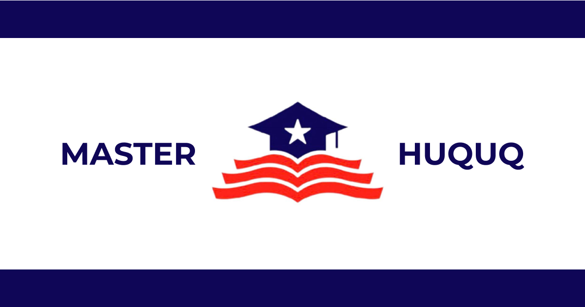
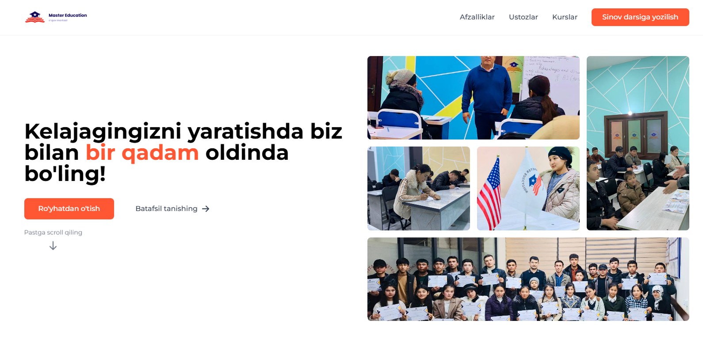
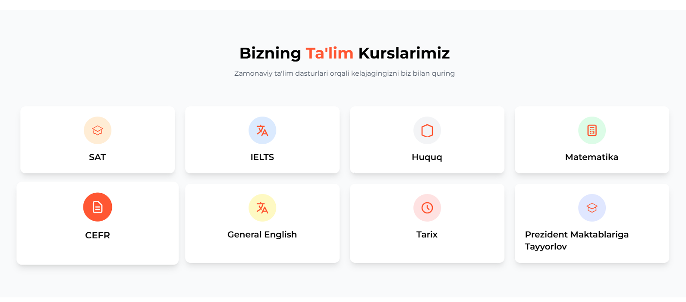
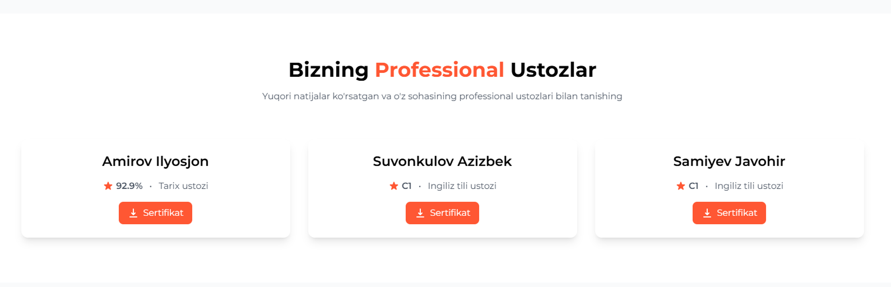

# Master Education Website

## 🎯 About The Project

A modern, responsive website for Master Education - a professional education center in Uzbekistan. Built with HTML, CSS (TailwindCSS), and JavaScript, this project showcases a clean and user-friendly interface for students to learn about courses and connect with teachers.

## ✨ Features

-   🎨 Modern and responsive design
-   📱 Mobile-first approach
-   🚀 Fast loading and optimized performance
-   📝 Easy lead generation through contact forms
-   🔍 SEO optimized
-   📄 Teacher certificate downloads
-   💼 Course showcase section

## 🛠️ Built With

-   HTML5
-   CSS3 (TailwindCSS)
-   JavaScript
-   ModmeCRM API Integration

## 🖥️ Demo

Live demo: [Master Education Website](https://master-huquq.netlify.app)

## 📸 Screenshots

Click to expand

### Home Page

### Courses Section

### Teachers Section

## Project Link

Project Link: [https://github.com/yourusername/master-education](https://github.com/yourusername/master-education)

## 🙏 Acknowledgments

-   [TailwindCSS](https://tailwindcss.com)
-   [ModmeCRM](https://modme.uz)
-   [Heroicons](https://heroicons.com)
